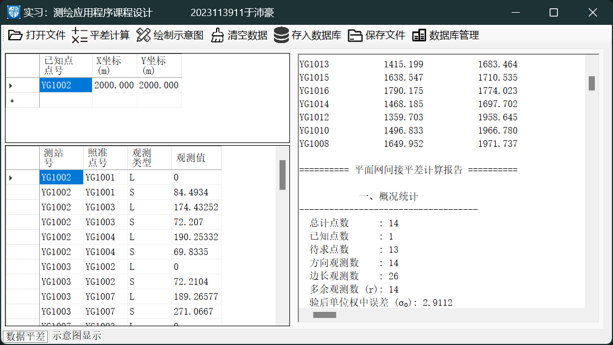
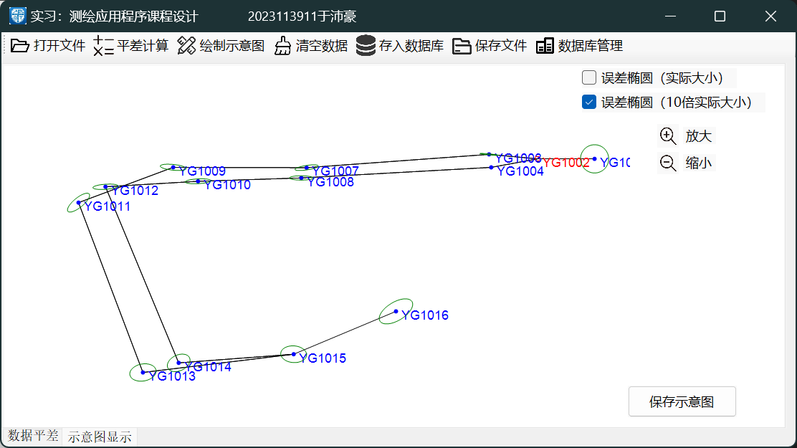
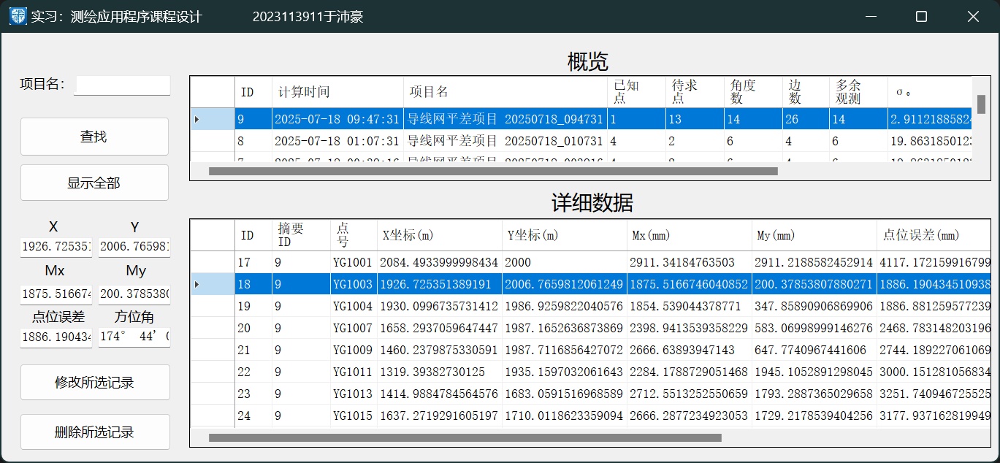

# PlaneADJ - 2D Surveying Network Adjustment

A C#/.NET desktop application for processing and adjusting 2D surveying control networks. This project was developed as a core assignment for the Surveying and Mapping curriculum at **Southwest Jiaotong University (SWJTU)**.


---

## Features

This application provides a complete workflow for plane network adjustment, from data input to final report generation.

-   **Data Parsing**: Reads and parses standard `.in2` free-format survey data files, automatically identifying known points, observations (angles and distances), and special orientation records.
-   **Approximate Coordinate Calculation**: Computes initial coordinates for unknown points using traverse calculation methods, supporting complex network configurations.
-   **Least Squares Adjustment**: Implements a rigorous indirect adjustment model based on the least squares principle to calculate precise coordinate corrections.
-   **Accuracy Assessment & Reporting**:
    -   Generates a detailed adjustment report, including standard deviations (`Mx`, `My`), point position errors (`Mp`), and the posterior unit weight standard deviation (`σ₀`).
    -   Visualizes the control network, distinguishing between known and unknown points.
    -   (Optional) Plots a point's **error ellipse** to provide an intuitive representation of its positional accuracy.

---

## Screenshots

**Main Interface (Data & Report)**


**Network Visualization**


**Database Management**


---

## Getting Started

### Prerequisites

-   [Visual Studio](https://visualstudio.microsoft.com/)
-   [.NET Framework](https://dotnet.microsoft.com/en-us/download/dotnet-framework) (Version specified in the project file)

### Installation

1.  **Clone the repository:**
    ```bash
    git clone https://github.com/B1AnKAlpha/PlaneAdjustment.git
    ```
2.  **Open the project:**
    -   Navigate to the `Code/` directory.
    -   Open the `.sln` (solution) or `.csproj` (project) file with Visual Studio.
3.  **Restore NuGet Packages:**
    -   Visual Studio should automatically restore the required packages. If not, right-click the solution in the Solution Explorer and select "Restore NuGet Packages."
4.  **Run the application:**
    -   Press `F5` or click the "Start" button in Visual Studio.

---

## Tech Stack

-   **Language**: C#
-   **Framework**: .NET Framework
-   **UI**: Windows Forms (WinForms)
-   **Key Libraries**:
    -   `MathNet.Numerics`: For high-performance matrix computations.
    -   `ScottPlot.WinForms`: For interactive data visualization and plotting.
